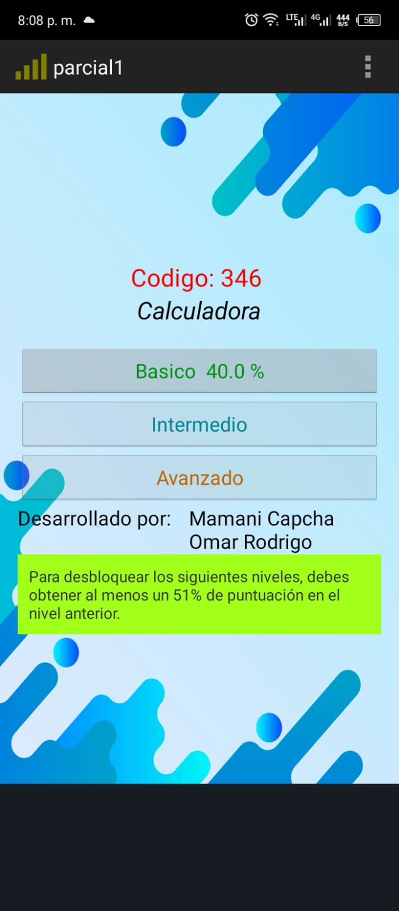
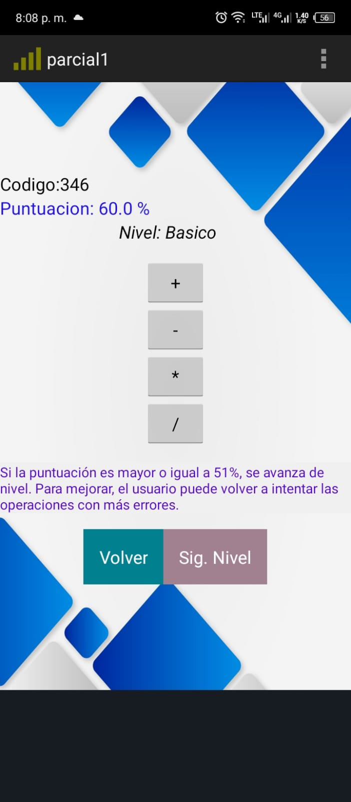
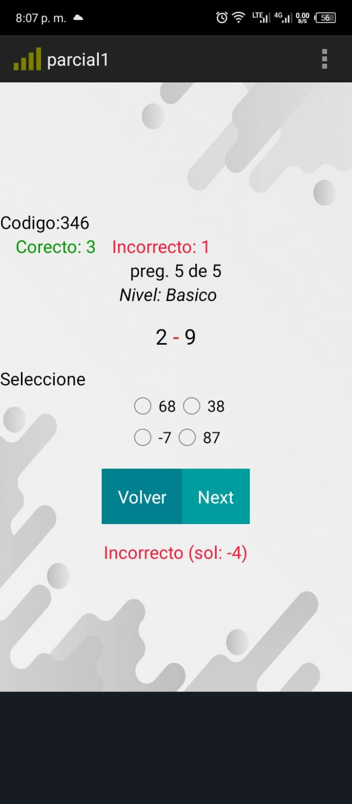

# Juego de Matemáticas en Android

Este proyecto es una aplicación móvil educativa desarrollada para el sistema operativo Android, con el objetivo de mejorar las habilidades matemáticas de los usuarios a través de un juego interactivo.

## Descripción

El juego ofrece tres niveles de dificultad: **Básico**, **Intermedio** y **Avanzado**, que abarcan las cuatro operaciones matemáticas fundamentales: **suma**, **resta**, **multiplicación** y **división**. Los usuarios deben obtener una puntuación superior o igual al 51% en cada nivel para avanzar al siguiente.

### Características Principales

- **Niveles de dificultad**:
  - **Básico**: Operaciones de un solo dígito.
  - **Intermedio**: Operaciones de dos dígitos.
  - **Avanzado**: Operaciones de tres dígitos.
  
- **Operaciones matemáticas**: Suma (+), resta (-), multiplicación (×) y división (÷).
- **Sistema de puntuación**: Se requiere un mínimo del 51% de respuestas correctas para avanzar al siguiente nivel.

## Estructura del Proyecto

El proyecto está compuesto por las siguientes clases principales:

1. **Calculadora**: Maneja la lógica detrás de las operaciones matemáticas.
2. **MainActivity**: Controla el flujo principal del juego y la navegación entre los niveles.
3. **OpeActivity**: Permite la selección de la operación matemática.
4. **SelectOpeActivity**: Presenta las preguntas y verifica las respuestas del usuario.

### Flujo del juego

1. El jugador elige un nivel de dificultad.
2. Se presentan operaciones matemáticas aleatorias.
3. El usuario selecciona una de las opciones de respuesta.
4. Dependiendo de su rendimiento, el jugador puede avanzar al siguiente nivel.


## Capturas de Pantalla

### Pantalla Principal
<!--

-->


### Selección de Operaciones


### Preguntas y Respuestas



## Instalación

Para instalar y ejecutar este proyecto en tu entorno local:

1. Clona este repositorio:  
   ```bash
   git clone https://github.com/tu-usuario/nombre-del-repositorio.git
